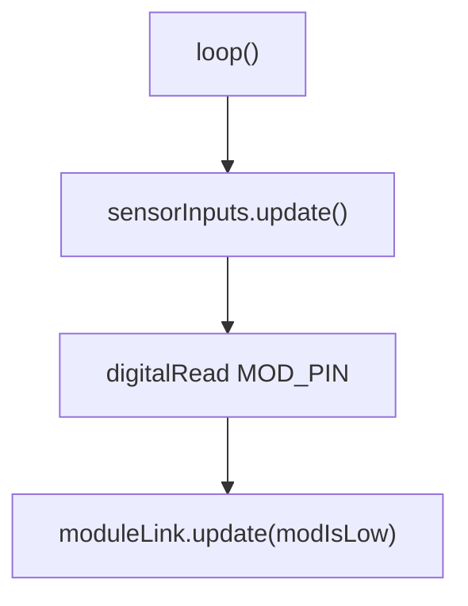

# Firmware architecture

[Home](home.md) · Reference: [Architecture](reference/architecture.md)

## Summary

This firmware runs on the ATmega328PB sensor daughterboard. The ESP32
motherboard is the I2C master on TWI1. This board is the master on
TWI0, where it reads three 4-20 mA inputs through an ADS1115. Plugging
it in is enough for the motherboard to assign an address and identify
a sensor module with three inputs.

`src/main.cpp` is the composition root. It owns the pin constants and
the product settings, constructs the adapters, the scan, and the link,
and calls `update()` on the scan and the link.

## Where it sits

Global construction runs before `setup()`. `ModuleLink` registers its
master-write handler there. The slave stays off until `loop()` sees
MOD low.

The motherboard bus is schematic I2C0. On this chip that is TWI1,
Arduino `Wire1`. The ADC bus is schematic I2C1, TWI0 on PC4 and PC5,
Arduino `Wire`. The ADS1115 is the only device on that bus.

## What it creates

```text
main.cpp
  AvrTwi1Slave     TWI1 adapter for IModuleSlavePort
  AvrAds1115       TWI0 adapter for IAds1115
  SensorInputs     round-robin scan and the sample cache
  ModuleLink       MOD gate, frames, and replies
```

`main.cpp` passes `MODULE_TYPE` and `FIRMWARE_VERSION` into the link,
and passes the ADS1115 address, gain, rate, input count, and connected
threshold into the scan. Pin numbers stay in `main.cpp`.

`lib/Interfaces/` holds `IModuleSlavePort` and the copied
`ModuleProtocol.h`. `lib/Drivers/` holds the AVR adapter. `lib/Logic/`
holds the link. Desktop fakes live in `test/test_desktop/fakes/`.

## One update

`setup()` drives `SNS_PIN` low so the motherboard sense line says the
module is seated, and holds `MOD_PIN` as an input with pull-up.



`loop()` does not block, so a low MOD is seen inside `kModGateMaxMs`.
Each sensor pass makes one ADC-driver call and returns. While the
module has no address, MOD low enables `0x0A` and MOD high disables
it. After a valid `SET_ADDRESS`, the link keeps that address when MOD
rises.

## What is stored, and who reads it

Each pass reads `MOD_PIN` and passes that level to the link. The
motherboard reads the sense line, which `SNS_PIN` holds low.

The link stores the address and whether it has been assigned. The TWI1
adapter stores the reply the host clocks out. The scan stores the
latest ADS1115 counts. Those stores are on the
[module link](module-link.md), [sensor inputs](sensor-inputs.md),
[slave port](slave-port.md), and [ADC port](adc-port.md) pages.

## See also

- [Architecture reference](reference/architecture.md) — pins, the pass, the image build.
- [Module link](module-link.md)
- [Sensor inputs](sensor-inputs.md)
- [Slave port](slave-port.md)
- [ADC port](adc-port.md)
