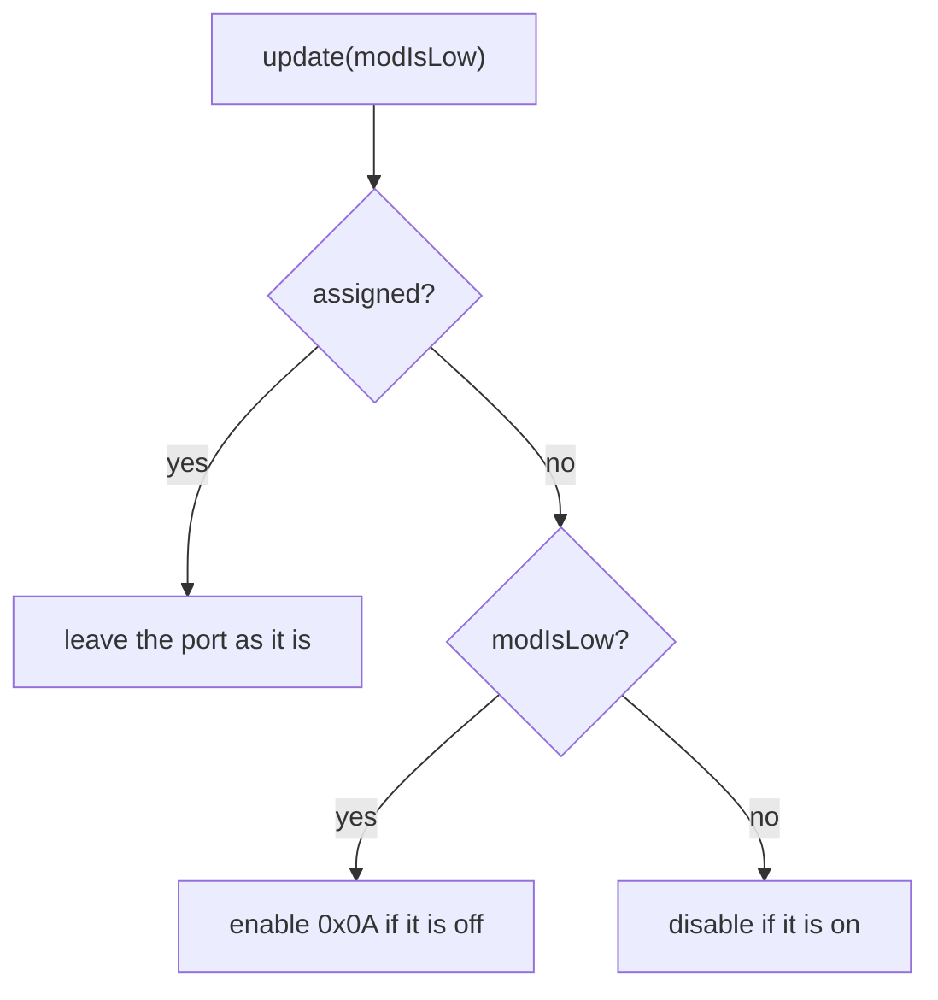

# Module link

[Home](home.md) · Reference: [Module link](reference/module-link.md)

## Summary

`ModuleLink` is the slave side of the motherboard module protocol for
this sensor board. It listens at `0x0A` only while MOD is low, then
keeps the assigned address. It reports the type and firmware version
supplied at construction, protocol version 1, and the sensor count and
samples held by `SensorInputs`.

The module includes no Arduino headers.

## Where it sits

`main.cpp` constructs it with `AvrTwi1Slave`, `SensorInputs`,
`MODULE_TYPE` (`kTypeSensorModule`), and `FIRMWARE_VERSION`. `loop()`
calls `update(modIsLow)`. A master write arrives through the handler
the constructor registered, from the TWI receive callback or from
`FakeModuleSlavePort::deliver`.

## What it creates

```text
ModuleLink
  IModuleSlavePort    enable, disable, setAddress, setReply
  SensorInputs        count, connected flag, raw counts
```

The link has no submodules. It cannot be copied: the port stores the
link as the write context. The link reads the sensor cache. It does
not advance the scan.

## One update



A master write is a separate path. The port calls the handler from the
TWI interrupt, or the fake calls it from `deliver`. Commands, rejects,
and the padded reply are in the [reference](reference/module-link.md).

## What is stored, and who reads it

`_typeId` and `_firmwareVersion` come from the constructor.
`GET_IDENTITY` reads them. `GET_SENSOR_COUNT`, `GET_SENSOR_CONNECTED`,
and `GET_SENSOR_READING` read the `SensorInputs` cache.

`_address` starts at `kUnconfiguredAddress`. `update` enables that
address while MOD is low. An accepted `SET_ADDRESS` replaces it and
sets `_assigned`. `_enabled` records whether the port is listening.
Once `_assigned` is set, `update` leaves the port alone.

The link does not keep the last reply. `setReply` copies it into the
port before the handler returns. The host reads that copy.

## See also

- [Module link reference](reference/module-link.md) — states, commands, errors, tests.
- [Sensor inputs](sensor-inputs.md)
- [Slave port](slave-port.md)
- [Architecture](architecture.md)
