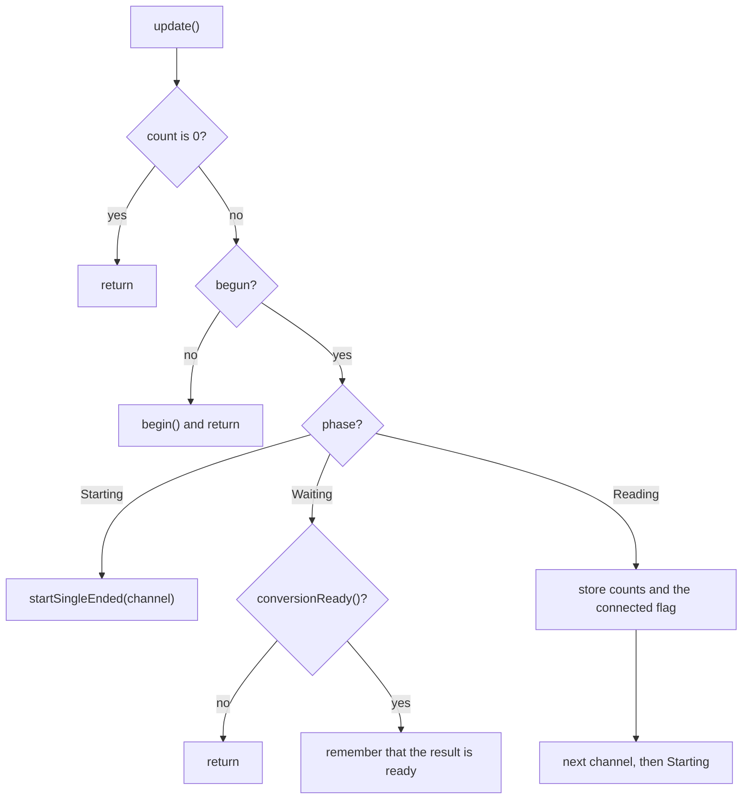

# Sensor inputs

[Home](home.md) · Reference: [Sensor inputs](reference/sensor-inputs.md)

## Summary

`SensorInputs` scans the ADS1115 and keeps the latest counts for each
input. `ModuleLink` reads that cache when the motherboard asks for a
count, a presence, or a reading. The scan runs from `loop()`. The TWI1
handler does not talk to the ADC.

## Where it sits

`main.cpp` constructs it with `AvrAds1115`, `SENSOR_COUNT`, and
`SENSOR_CONNECTED_MIN_COUNTS`. `loop()` calls `update()` and then
`moduleLink.update()`. The link does not call `update()`.

## What it creates

```text
SensorInputs
  IAds1115    begin, start, poll, read
```

On this board the count is 3. Index 0 is Sens1 on AIN0, index 1 is
Sens2 on AIN1, and index 2 is Sens3 on AIN2. AIN3 is unconnected.

## One update



One `update()` makes one driver call. The first sample is a begin, a
start, a ready poll, and a read. Each later sample is a start, a poll,
and a read.

## What is stored, and who reads it

The constructor stores the count and the connected threshold.
`update()` stores the latest counts and a connected flag for each
input. The flag is set when the counts are at or above
`SENSOR_CONNECTED_MIN_COUNTS`.

The valid flag for that input is cleared before those bytes are
written and set after them. `ModuleLink` reads an input from the TWI1
handler only while its flag is set. Until the first stored conversion,
the link replies `Busy`.

## See also

- [Sensor inputs reference](reference/sensor-inputs.md) — phases, the threshold, tests.
- [ADC port](adc-port.md)
- [Module link](module-link.md)
- [Architecture](architecture.md)
