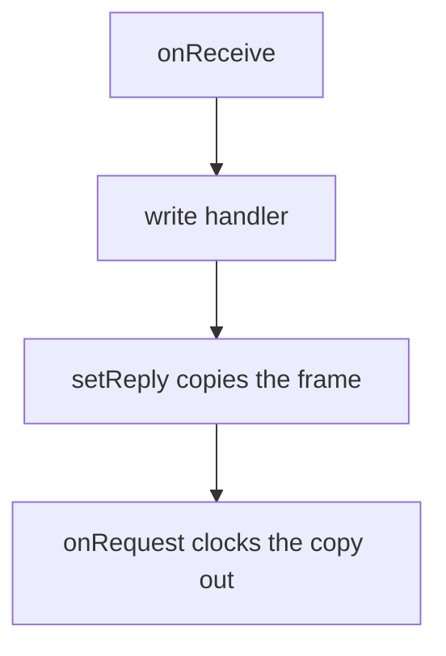

# Slave port

[Home](home.md) · Reference: [Slave port](reference/slave-port.md)

## Summary

`IModuleSlavePort` is the seam between the link and the bus.
`AvrTwi1Slave` is the TWI1 adapter. Desktop tests use
`FakeModuleSlavePort`. The fake's `deliver` calls the same handler the
driver's receive callback calls.

## Where it sits

`main.cpp` constructs `AvrTwi1Slave` and passes it to `ModuleLink`. The
link calls `enable`, `disable`, `setAddress`, and `setReply`. The
driver calls the link back on a master write. Tests construct the fake
in place of the driver.

## What it creates

```text
IModuleSlavePort
  AvrTwi1Slave          Wire1 on TWI1
  FakeModuleSlavePort   records calls
```

Wire's callbacks are plain function pointers, so one driver instance
is the active slave. That instance attaches one protocol handler.

## One update

The sketch does not call the driver. One transaction is a master
write, then the repeated-start read.



`setAddress` writes `TWAR1` from the stop callback and leaves the bus
up. `disable` calls `Wire1.end()`.

## What is stored, and who reads it

The driver keeps the handler, the reply bytes, and whether TWI1 is
enabled. The host clocks the reply out on the next read. `TWAR1` is
the address the peripheral acknowledges. The fake keeps the same calls
so a test can read them.

`SCL_PIN` and `SDA_PIN` name the motherboard-bus pins. `Wire1` takes
no pin argument, because TWI1's pins are fixed.

## See also

- [Slave port reference](reference/slave-port.md) — `TWAR1`, pin names, what the fake records.
- [Module link](module-link.md)
- [Architecture](architecture.md)
